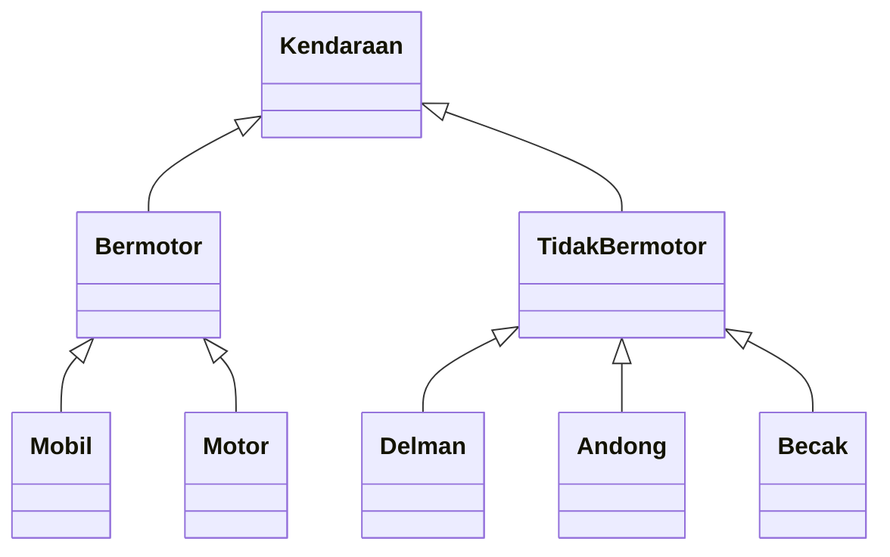

# Polimorfisme

<div class="grid grid-cols-2 gap-y-10 gap-x-6 mt-4">
<div class='flex-row'>
<div class='text-base text-justify mt-4'>

**Polimorfisme** adalah kemampuan untuk mempunyai beberapa bentuk class yang berbeda. Polimorfisme ini terjadi pada saat suatu objek bertipe **parent class**, akan tetapi **pemanggilan constructornya melalui child class/sub class**.

Contoh:

```java 
Kendaraan bmw = new Mobil();
```


</div>
</div>
<div class='flex-row flex justify-center items-center'>



</div>
</div>
